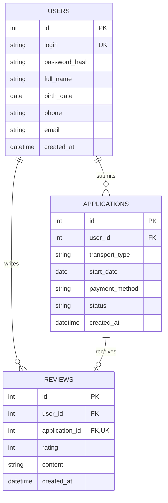

# ER-диаграмма портала «Водить.РФ»

## Связи

- `users -> applications`: один пользователь может создать много заявок.
- `users -> reviews`: один пользователь может оставить много отзывов.
- `applications -> reviews`: у завершенной заявки может быть максимум один отзыв.

## Бизнес-правила

- логин пользователя уникален;
- заявка создается со статусом `Новая`;
- статус меняет только администратор;
- отзыв разрешен только для завершенной заявки.
